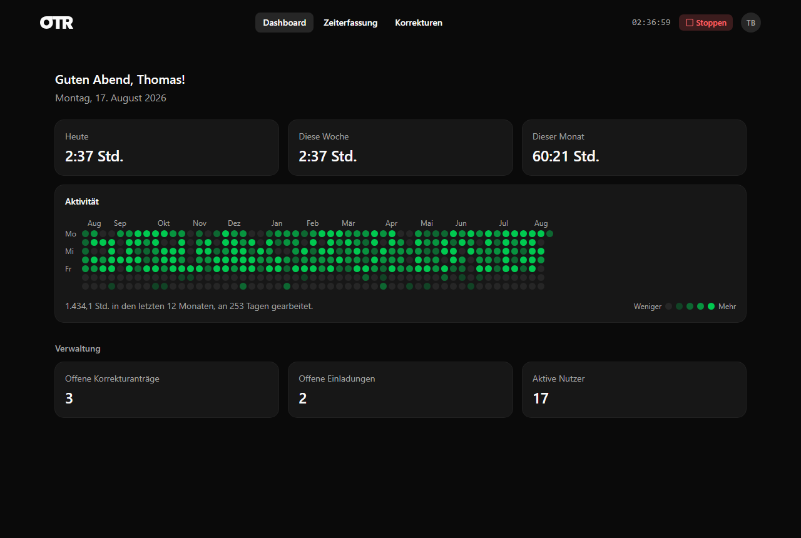

  

<h1 align="center">Open Time Record (OTR)</h1>

OTR is a self-hosted time tracking and team management app: employees clock their work time (including breaks) against projects, while Superadmins manage users, roles, teams, and a fine-grained permission system.

  

---

## Contents

- [Accounts, Access & Invitations](#accounts-access--invitations)
- [Time Tracking](#time-tracking)
- [Breaks](#breaks)
- [Correction Requests](#correction-requests)
- [Dashboard](#dashboard)
- [User Management](#user-management)
- [Roles & Permissions](#roles--permissions)
- [Teams](#teams)
- [Projects](#projects)
- [Settings](#settings)
- [General Experience](#general-experience)

---

## Accounts, Access & Invitations

- **Registration** with first/last name, email, and password. The **very first person ever to register** automatically becomes Superadmin and skips email verification.
- **Email verification**: new accounts (without an invitation) receive a 6-digit code by email, valid for 24 hours; the code can be resent.
- **Login** with email/password, backed by JWT.
- **Invite a user** (Superadmin): email address, a **role (required)**, and optionally a **team** and a **manager**.
  - Picking a team automatically suggests that team's manager — but it stays freely editable.
  - The invitation can be **sent by email** or turned into a **link** you share yourself (chat, etc.). The link takes the invitee straight to a pre-filled registration form.
  - The role, team, and manager from the invitation are applied to the new account automatically on registration; email verification is skipped in that case.
- **Create a user manually** (Superadmin): set up an account, password included, with no invitation or verification step at all — gated by the fine-grained permission system rather than a hardcoded role check.

## Time Tracking

- **Start/stop clock** for your own work time, always reachable from the header — the running time is counted live right there.
- Attach a **project** and a **description** to the running or a past entry; both stay editable afterwards.
- View, edit, and delete your own time entries.
- Every entry's row shows its **net worked duration** (start to end, minus all breaks) as its own, prominent column.
- The **browser tab title** shows the live elapsed time (`HH:mm`) while the clock is running.

## Breaks

- While the clock is running, **start and end a break**, optionally with a reason.
- Whether a break reason is **required** is a system-wide setting the admin controls (Settings → System).
- Break time is automatically subtracted from worked time — live in the running display, in the duration column, and on the dashboard.
- Stopping a time entry while a break is still open automatically closes that break too.

## Correction Requests

- File a **correction request** on one of your own completed time entries through a dialog (new start/end time, reason).
- The dialog shows the relevant **manager(s)** up front, resolved from your team membership, for context.
- Superadmins see every open request and can **approve or reject** it.

## Dashboard

- Personal **Today / This Week / This Month** stats (net worked time, updating live).
- A **GitHub-style activity heatmap** covering the last ~12 months: one cell per day, color intensity scaled to hours worked, with month/weekday labels, a per-day tooltip, and a legend.
- **Superadmins** additionally see an admin overview: counts of open correction requests, open invitations, and active users, each linking to the relevant page.

## User Management

*(Settings → Users, Superadmin)*

- List every user with their status; **activate/deactivate** accounts.
- **Assign or remove roles and teams** per user.
- **Profile picture** per user (PNG/JPEG/GIF/WEBP, 2 MB limit, verified server-side against the actual file signature) — everyone can only upload or remove their own; whether the feature is available at all is an admin-controlled setting.

## Roles & Permissions

*(Settings → Roles, Superadmin)*

- Create roles with a short name and a display name; activate/deactivate them.
- **Fine-grained permissions per role**: set a level of **None / Read / Write / Admin** for each of 20 resources —
  Time Entries, Projects, Users, Rules, Roles, Teams, Correction Requests, Invitations, SMTP Settings, App Settings, Clients, Project Tasks, Tags, Work Schedules, Leave Types, Leave Requests, Leave Balances, Public Holidays, Notifications, Audit Log.
- The Superadmin role automatically holds Admin on every resource.

## Teams

*(Settings → Teams, Superadmin)*

- Create teams with a short name, a display name, and an assigned **manager**; activate/deactivate them.
- That manager is suggested throughout the app — when inviting or manually creating a user, and in correction requests.

## Projects

*(Settings → Projects, Superadmin)*

- Create projects with a short name and a display name, and activate/deactivate them; they then appear as choices in time tracking.

## Settings

- **Appearance**: light/dark theme, follows the system preference by default, switchable any time — available to everyone.
- **SMTP** (Superadmin): configure your own mail server for verification and invitation emails (host, port, TLS/SSL, credentials, sender). The password is stored encrypted.
- **System** (Superadmin): toggle profile pictures app-wide, toggle whether a break reason is required.
- **Information**: product name, version, and a short description of OTR — available to everyone.

## General Experience

- Creating anything (a role, team, project, invitation, user, correction request, break) goes through a focused dialog rather than an inline form.
- Settings live in their own area with sidebar navigation; administrative pages are only visible to Superadmins.
- A user menu in the top right (avatar, picture or initials) holds your name, email, profile picture management, a link to Settings, and sign-out.
